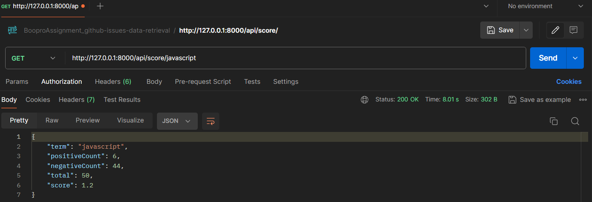
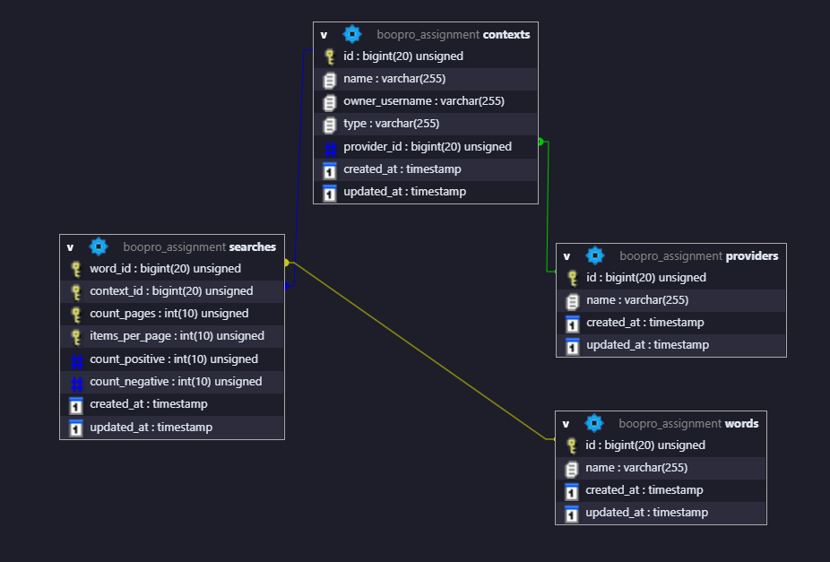

<!-- Improved compatibility of back to top link: See: https://github.com/othneildrew/Best-README-Template/pull/73 -->
<a name="readme-top"></a>
<!--
*** Thanks for checking out the Best-README-Template. If you have a suggestion
*** that would make this better, please fork the repo and create a pull request
*** or simply open an issue with the tag "enhancement".
*** Don't forget to give the project a star!
*** Thanks again! Now go create something AMAZING! :D
-->


<!-- PROJECT SHIELDS -->
<!--
*** I'm using markdown "reference style" links for readability.
*** Reference links are enclosed in brackets [ ] instead of parentheses ( ).
*** See the bottom of this document for the declaration of the reference variables
*** for contributors-url, forks-url, etc. This is an optional, concise syntax you may use.
*** https://www.markdownguide.org/basic-syntax/#reference-style-links
-->

[//]: # ([![Contributors][contributors-shield]][contributors-url])

[//]: # ([![Forks][forks-shield]][forks-url])

[//]: # ([![Stargazers][stars-shield]][stars-url])

[//]: # ([![Issues][issues-shield]][issues-url])

[//]: # ([![MIT License][license-shield]][license-url])

[//]: # ([![LinkedIn][linkedin-shield]][linkedin-url])


<!-- PROJECT LOGO -->
<br />
<div align="center">
  <a href="https://github.com/birisic/BooproAssignment">
    
  </a>

<h3 align="center">Word Popularity Score App</h3>

  <p align="center">
    This is an assignment project for Boopro. The primary objective here was to make a scalable web application 
in Laravel 11 that would search GitHub issues and efficiently calculate a popularity score for any word. The application 
and the underlying MySQL database are designed to support adding new search providers in the future.
    <br />
    <br />
    <br />
  </p>
</div>


<!-- TABLE OF CONTENTS -->
<details>
  <summary>Table of Contents</summary>
  <ol>
    <li>
      <a href="#about-the-project">About The Project</a>
      <ul>
        <li><a href="#built-with">Built With</a></li>
      </ul>
    </li>
    <li>
      <a href="#getting-started">Getting Started</a>
      <ul>
        <li><a href="#prerequisites">Prerequisites</a></li>
        <li><a href="#installation">Installation</a></li>
      </ul>
    </li>
    <li><a href="#usage">Usage</a></li>
    <li><a href="#roadmap">Roadmap</a></li>
    <li><a href="#contributing">Contributing</a></li>
    <li><a href="#license">License</a></li>
    <li><a href="#contact">Contact</a></li>
    <li><a href="#acknowledgments">Acknowledgments</a></li>
  </ol>
</details>


<!-- ABOUT THE PROJECT -->
## About The Project

The project was realised as a `Laravel API` and its main intent was to make a custom way of calculating the popularity score for
a given word. The score is represented by float numbers from 0 to 10 and its calculated 
based on this formula: `(positive_results / total_results) * 10`.
<br/>
<br/>
Positive results represent the total number of occurrences of the `{word} rocks` pattern, where word is the searched word.
Negative results just follow a different pattern, `{word} sucks`. The application is made to use a search provider and its contexts
to look for these positive and negative results and calculate a score based on them. The search provider in this case was GitHub itself
with its `REST API`, and the context was all publicly available GitHub issues, from all public repositories, or from a single repository. 
<br/>
<br/>
The application has one single `GET route` with two parameters, the first of which is mandatory, and it's the actual word 
that will be searched. The second parameter is an optional platform with a default value of "GitHub" (`/score/{word}/{platform?}`).
<br/>
<br/>
`SearchController` is responsible for handling requests coming in from this route, and it has a couple of fields that are
used throughout the class extensively. It uses an `environment variable` which holds a GitHub access token for authenticating
requests sent to the GitHub REST API from which the app receives its data.
<br/>
<br/>
To not allow any platform parameter values which are not supported on the system, and also minimize human error in validation,
the controller uses the `SearchProviderEnum` to get name constants for all the supported search providers and validate
the parameter value based on that.
<br/>
<br/>
The controller also includes the ability to check whether there are any records for the given word parameter already present
in the database, and `if the data is not too stale`. It checks for this by comparing the time of the search with the updated_at column
and checks if there isn't more than an hour of difference between the two. If the check passes, it retrieves the data straight
from the database `without searching and making network calls again`, significantly reducing the time of execution. Otherwise, 
it has no other option but to search again and try to refresh the data. 
<br/>
<br/>
To aid the controller in working with the different search providers, I've envisioned that a different class will exist
for every new search provider supported, `separating concerns` and `decoupling the code` while following the
`Single Responsibility` and `Open-Closed` SOLID Principles. For the purposes of this assignment, I've added a new App\Services layer
and inside of it created two service classes: `AbstractSearchProviderService` and `GitHubService`.
<br/>
<br/>
An abstract class is provided to be the primary base class for all new search provider classes created in the future. 
It includes some general fields which will probably be needed for all extended classes, and `prescribes two abstract methods`
that all extended classes need to provide an implementation for: search and calcPopularityScore.
<br/>
<br/>
The `GitHubService class` is the place where all the magic happens. It is responsible for handling `REST API network calls`, 
updating database records, and returning scores or messages to the controller. It contains a robust set of methods for encapsulating
and working with the `business logic` of the assignment.
<br/>
<br/>
`Postman` was used heavily for the development purposes of this assignment, and here are two examples of successful executions, 
the first one being with a network call, and the second being loaded from the database:




<p align="right">(<a href="#readme-top">back to top</a>)</p>


<!-- DATABASE DESIGN -->
## About The Database

[//]: # ()

Here's a blank template to get started: To avoid retyping too much info. Do a search and replace with your text editor for the following: `birisic`, `BooproAssignment`, `twitter_handle`, `linkedin_username`, `email_client`, `email`, `project_title`, `project_description`

<p align="right">(<a href="#readme-top">back to top</a>)</p>


<!-- AFTER CLONING -->
## How To Kick-Start The Project


Here's a blank template to get started: To avoid retyping too much info. Do a search and replace with your text editor for the following: `birisic`, `BooproAssignment`, `twitter_handle`, `linkedin_username`, `email_client`, `email`, `project_title`, `project_description`

<p align="right">(<a href="#readme-top">back to top</a>)</p>


### Built With

* [![Next][Next.js]][Next-url]
* [![React][React.js]][React-url]
* [![Vue][Vue.js]][Vue-url]
* [![Angular][Angular.io]][Angular-url]
* [![Svelte][Svelte.dev]][Svelte-url]
* [![Laravel][Laravel.com]][Laravel-url]
* [![Bootstrap][Bootstrap.com]][Bootstrap-url]
* [![JQuery][JQuery.com]][JQuery-url]

<p align="right">(<a href="#readme-top">back to top</a>)</p>


<!-- GETTING STARTED -->
## Getting Started

This is an example of how you may give instructions on setting up your project locally.
To get a local copy up and running follow these simple example steps.

### Prerequisites

This is an example of how to list things you need to use the software and how to install them.
* npm
  ```sh
  npm install npm@latest -g
  ```

### Installation

1. Get a free API Key at [https://example.com](https://example.com)
2. Clone the repo
   ```sh
   git clone https://github.com/birisic/BooproAssignment.git
   ```
3. Install NPM packages
   ```sh
   npm install
   ```
4. Enter your API in `config.js`
   ```js
   const API_KEY = 'ENTER YOUR API';
   ```

<p align="right">(<a href="#readme-top">back to top</a>)</p>


<!-- USAGE EXAMPLES -->
## Usage

Use this space to show useful examples of how a project can be used. Additional screenshots, code examples and demos work well in this space. You may also link to more resources.

_For more examples, please refer to the [Documentation](https://example.com)_

<p align="right">(<a href="#readme-top">back to top</a>)</p>


<!-- ROADMAP -->
## Roadmap

- [ ] Feature 1
- [ ] Feature 2
- [ ] Feature 3
    - [ ] Nested Feature

See the [open issues](https://github.com/birisic/BooproAssignment/issues) for a full list of proposed features (and known issues).

<p align="right">(<a href="#readme-top">back to top</a>)</p>


<!-- CONTRIBUTING -->
## Contributing

Contributions are what make the open source community such an amazing place to learn, inspire, and create. Any contributions you make are **greatly appreciated**.

If you have a suggestion that would make this better, please fork the repo and create a pull request. You can also simply open an issue with the tag "enhancement".
Don't forget to give the project a star! Thanks again!

1. Fork the Project
2. Create your Feature Branch (`git checkout -b feature/AmazingFeature`)
3. Commit your Changes (`git commit -m 'Add some AmazingFeature'`)
4. Push to the Branch (`git push origin feature/AmazingFeature`)
5. Open a Pull Request

<p align="right">(<a href="#readme-top">back to top</a>)</p>


<!-- LICENSE -->
## License

Distributed under the MIT License. See `LICENSE.txt` for more information.

<p align="right">(<a href="#readme-top">back to top</a>)</p>


<!-- CONTACT -->
## Contact

Your Name - [@twitter_handle](https://twitter.com/twitter_handle) - email@email_client.com

Project Link: [https://github.com/birisic/BooproAssignment](https://github.com/birisic/BooproAssignment)

<p align="right">(<a href="#readme-top">back to top</a>)</p>


<!-- ACKNOWLEDGMENTS -->
## Acknowledgments

* []()
* []()
* []()

<p align="right">(<a href="#readme-top">back to top</a>)</p>


<!-- MARKDOWN LINKS & IMAGES -->
<!-- https://www.markdownguide.org/basic-syntax/#reference-style-links -->
[contributors-shield]: https://img.shields.io/github/contributors/birisic/BooproAssignment.svg?style=for-the-badge
[contributors-url]: https://github.com/birisic/BooproAssignment/graphs/contributors
[forks-shield]: https://img.shields.io/github/forks/birisic/BooproAssignment.svg?style=for-the-badge
[forks-url]: https://github.com/birisic/BooproAssignment/network/members
[stars-shield]: https://img.shields.io/github/stars/birisic/BooproAssignment.svg?style=for-the-badge
[stars-url]: https://github.com/birisic/BooproAssignment/stargazers
[issues-shield]: https://img.shields.io/github/issues/birisic/BooproAssignment.svg?style=for-the-badge
[issues-url]: https://github.com/birisic/BooproAssignment/issues
[license-shield]: https://img.shields.io/github/license/birisic/BooproAssignment.svg?style=for-the-badge
[license-url]: https://github.com/birisic/BooproAssignment/blob/master/LICENSE.txt
[linkedin-shield]: https://img.shields.io/badge/-LinkedIn-black.svg?style=for-the-badge&logo=linkedin&colorB=555
[linkedin-url]: https://linkedin.com/in/linkedin_username
[product-screenshot]: images/screenshot.png
[Next.js]: https://img.shields.io/badge/next.js-000000?style=for-the-badge&logo=nextdotjs&logoColor=white
[Next-url]: https://nextjs.org/
[React.js]: https://img.shields.io/badge/React-20232A?style=for-the-badge&logo=react&logoColor=61DAFB
[React-url]: https://reactjs.org/
[Vue.js]: https://img.shields.io/badge/Vue.js-35495E?style=for-the-badge&logo=vuedotjs&logoColor=4FC08D
[Vue-url]: https://vuejs.org/
[Angular.io]: https://img.shields.io/badge/Angular-DD0031?style=for-the-badge&logo=angular&logoColor=white
[Angular-url]: https://angular.io/
[Svelte.dev]: https://img.shields.io/badge/Svelte-4A4A55?style=for-the-badge&logo=svelte&logoColor=FF3E00
[Svelte-url]: https://svelte.dev/
[Laravel.com]: https://img.shields.io/badge/Laravel-FF2D20?style=for-the-badge&logo=laravel&logoColor=white
[Laravel-url]: https://laravel.com
[Bootstrap.com]: https://img.shields.io/badge/Bootstrap-563D7C?style=for-the-badge&logo=bootstrap&logoColor=white
[Bootstrap-url]: https://getbootstrap.com
[JQuery.com]: https://img.shields.io/badge/jQuery-0769AD?style=for-the-badge&logo=jquery&logoColor=white
[JQuery-url]: https://jquery.com 
